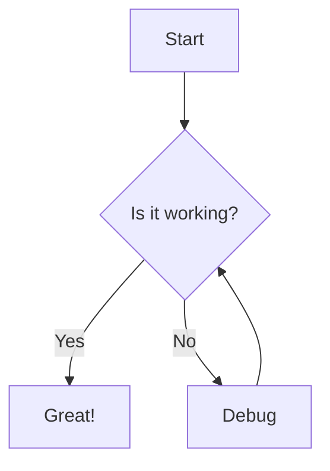

# A Week of Progress: Backend Sync and Frontend Updates

This past week has been a whirlwind of activity for our team. With the sprint in full swing, we’ve tackled bugs, synced up on backend priorities, and made strides on the frontend redesign. Here’s a rundown of what went down, complete with the highs, lows, and everything in between.

## Syncing Up and Solving Problems

Our week kicked off with a key meeting to align the backend team.

Meeting: Prathamesh, Rahul, 4-5 PM, Backend Sync, Resolved Issues

It was a productive hour—Prathamesh and Rahul hashed out some lingering API concerns, and we left with a clear plan to address them. This set the tone for a focused sprint. 

Of course, not everything went smoothly. We hit a snag mid-week that slowed us down.

Blocker: API downtime, Prathamesh

The API outage threw a wrench in our testing schedule, but Prathamesh flagged it early, and we pivoted to other tasks while the ops team sorted it out.

## Tasks in Motion

On the development front, Rahul’s been grinding away at a pesky login issue.

Task: Fix login bug, Rahul, In Progress

It’s not fully resolved yet, but Rahul’s making steady headway. We’re hoping to wrap this up before the sprint ends.

Meanwhile, I’ve taken on a smaller but necessary chore.

ActionItem: Update README, Rahul, 2025-03-20

The README’s been overdue for a refresh, and I’ve committed to getting it done by Thursday. It’s a small win, but it’ll keep our docs in sync with the codebase.

## Team Updates and Milestones

Friday’s stand-up gave us a chance to take stock.

StandUpSummary: 2025-03-14, Backend Team, Resolved API issues and made progress on login bug and README update for the frontend redesign. the team is in good spirits heading into the weekend. i am happy with the progress we made this week. today we discussed the progress of the tasks and the blockers we faced. we also discussed the plan for the next week. yesterday we had

StandUpSummary: 2025-03-15, Frontend Team, Fixed UI bugs, Updated designs, and made progress on the API checks. the team is in good spirits heading into the weekend. i am happy with the progress we made this week. today we discussed the progress of the tasks and the blockers we faced. we also discussed the plan for the next week. yesterday we had

The team reported that the API issues were finally behind us, thanks to some overnight heroics from the ops crew. It was a morale boost heading into the weekend.

On the frontend, we’re seeing real progress too.

Progress: Planning, 45%, Waiting on feedback

Progress: Frontend redesign, 55%, Waiting on feedback

Progress: API checks are done, 90%, Waiting on feedback

The new design is about three-quarters done. We’ve got a solid prototype, but it’s on hold until the design team weighs in. Fingers crossed they love it as much as we do!

## A Quick Tip

Here’s something we learned the hard way this week.

Callout: tip, Test this locally first

Before pushing anything API-related, test it locally. That downtime could’ve been less painful if we’d caught it sooner.

## Code in Action

Speaking of testing, here’s a snippet Rahul used to debug the login issue.

CodeSnippet: javascript, console.log('Hello');

Okay, it’s not the actual fix (that’s still in progress!), but it’s a reminder to keep logging and checking as you go. Sometimes the simplest tools get you through.

## Visual Progress

Finally, here’s a peek at where the frontend’s headed.

Image: /blog-placeholder-1.jpg, Dashboard, New design preview

It’s shaping up nicely, right? Once we get that feedback, we’ll polish it up and ship it.

---

This week showed what we’re capable of when we pull together—glitches and all. Next up, we’ll wrap up these tasks and start prepping for the deployment push. Stay tuned!

| Title          | Assignee | Status     |
|----------------|----------|------------|
| Fix login bug  | Rahul    | In Progress|
| Update README  | Prathamesh | Done     |
| Update README  | Prathamesh | Done     |
| Update README  | Prathamesh | Done     |
| Update README  | Prathamesh | Done     |
| Update README  | Prathamesh | Done     |
| Update README  | Prathamesh | Done     |
| Update README  | Prathamesh | Done     |

----------------

Milestone: 2025-03-17, App Launch, Released v1.0

Shoutout: Rahul, Fixed login bug in record time

Idea: Dark mode, High, Needs design input

---------

# Project Update: Sprint 3 Recap

## Timeline of Events

Timeline: Sprint 3 Milestones, fa-calendar Kickoff | Planned features and timeline, fa-check-square Code Freeze | Completed development, fa-play-circle Deployment | Released to staging, fa-bell Review | Team feedback collected

## Key Action Items

IconBullet: fa-lightbulb UI Enhancement | Propose dark mode toggle

IconBullet: fa-list-alt Task Assignment | Update backlog with new tickets

IconBullet: fa-handshake Collaboration | Sync with design team on assets

ResourceCard: Astro Docs, https://docs.astro.build

InteractiveTaskCard: Finish Docs, Complete API documentation by Friday